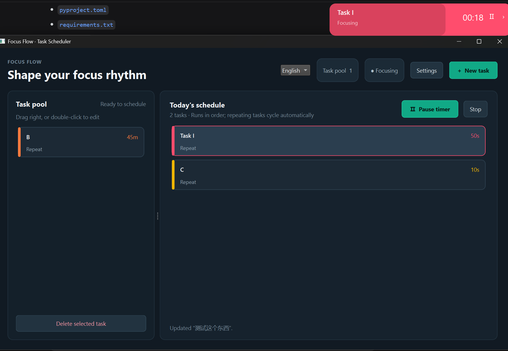

# Focus Flow

Focus Flow is a PySide6 desktop time-management app for arranging tasks into a repeating focus schedule.



## Features

- Add multiple tasks with vivid color choices.
- Set task duration in hours, minutes, and seconds.
- Choose repeating or one-time execution.
- In the task editor, use Copy to insert a duplicate directly below the original in the same list.
- Drag tasks between the task pool and schedule, then reorder them.
- Run tasks in order and automatically move one-time tasks back to the pool when they finish.
- Use an always-on-top, draggable floating timer with pause and skip controls.
- Hide the main window to the Windows notification area without stopping the timer.
- Left-click the tray icon to open the main UI.
- Right-click the tray icon to choose `Open main UI` or `Exit`.
- Change the UI language between English and Chinese from the main window. English is the default.
- Toggle the floating progress bar and remaining-time display in Settings.
- When remaining time is disabled, tasks longer than 30 seconds still show a countdown during the final 30 seconds.
- Play `assets/notification.mp3` whenever a scheduled timer reaches zero.
- Persist tasks, schedule order, display settings, and language selection.

## Environment

The project uses the dedicated Miniconda environment `adhd-timer`. Do not use the `base` environment or the system Python.

```powershell
conda create -n adhd-timer python=3.12 pip -y
conda run -n adhd-timer python -m pip install -r requirements.txt
```

## Run

PowerShell:

```powershell
.\scripts\run.bat
```

Or directly:

```powershell
conda run -n adhd-timer python -m focus_flow.app
```

Git Bash or a Unix-like shell:

```sh
./scripts/run.sh
```

## Build a Windows EXE

On Windows, create the `adhd-timer` Conda environment, then run from the project root:

```powershell
.\scripts\build.bat
```

The script installs the pinned build toolchain in `requirements-build.txt`, builds a windowed folder-based EXE using `bundle/FocusFlow.spec`, and bundles Python, Qt, QtMultimedia plugins, and `assets/notification.mp3`. It launches the frozen app from a separate temporary directory with Python/Conda paths removed, checks the UI and muted MP3 playback using the FFmpeg backend, then creates a ZIP and SHA-256 checksum. Previous ZIPs, checksums, and validation reports are removed at the start so a failed build cannot leave a stale release archive.

Outputs:

- `dist/FocusFlow/FocusFlow.exe`: application entry point.
- `dist/FocusFlow-windows-x64.zip`: distribute this ZIP; extract it entirely and run the EXE without installing Python or Conda.
- `dist/FocusFlow-windows-x64.zip.sha256`: archive checksum.
- `dist/smoke-report.json`: frozen application validation report.
- `dist/build-info.json`: Python version, architecture, and resolved build dependency versions; also included in the ZIP.

Keep the `_internal` directory next to the EXE. Build with 64-bit Python on Windows to produce the Windows x64 application.

Skip dependency installation on later builds:

```powershell
.\scripts\build.bat --skip-install
```

Equivalent Python pipeline command:

```powershell
conda run --no-capture-output -n adhd-timer python scripts\build.py
```

Raw PyInstaller command (build only, without smoke testing or ZIP creation):

```powershell
conda run --no-capture-output -n adhd-timer python -m PyInstaller --noconfirm --clean --distpath dist --workpath build bundle\FocusFlow.spec
```

## Test

PowerShell:

```powershell
.\scripts\test.bat
```

Unix-like shell:

```sh
./scripts/test.sh
```

The application stores its local state under the platform-specific Qt application-data directory.

See [README_zh.md](README_zh.md) for the Chinese documentation.
